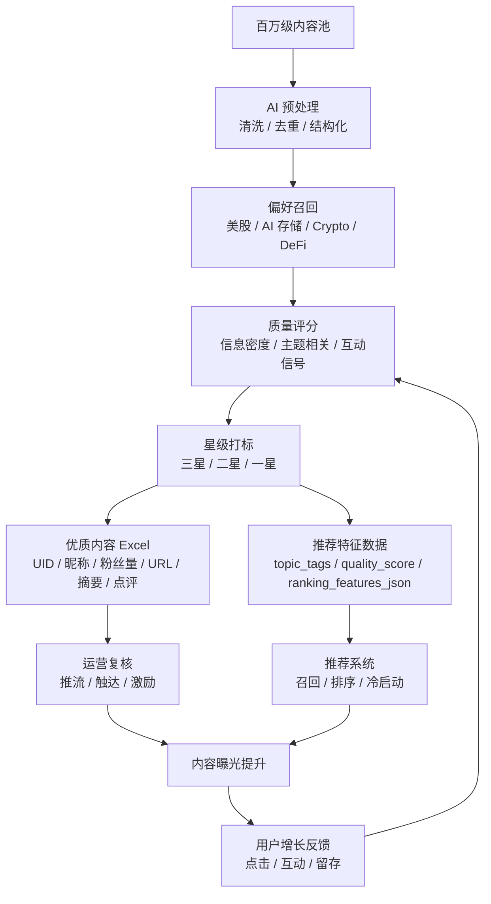
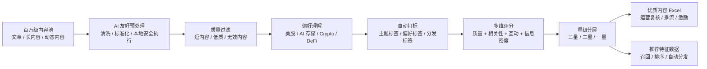

# AI Content Selector and Growth Turbo

百万级超大规模内容池，精华内容，AI 筛选分发神器。

[English](README_EN.md)

面向内容增长、社区冷启动、推荐算法种子内容建设和爆款内容挖掘。它可以把上百万规模的文章数据，通过 AI 友好的本地预处理、筛选、评分、去重、打标和分池，把真正有价值、符合预期、可能带来用户增长的精华内容提前找出来。

用户只要输入偏好方向，例如美股、AI 存储、Crypto、宏观、DeFi、ETF，系统就能自动识别匹配内容，给出一星、二星、三星质量标签，并生成两类结果：

1. **优质内容 Excel**：给运营、增长、编辑、推荐策略同学快速复核。
2. **推荐特征数据**：给推荐系统、召回策略、分发系统作为标签和特征输入。

以前需要几十个编辑连续翻内容池、讨论、复核，才能产出一版可用的精华内容结果。现在先让工具跑一轮，5 分钟内拿到高质量内容池、推荐标签和全量评分，再由运营或 Agent 做少量复核。它不是简单筛内容，而是一套内容驱动增长的自动化基础设施。

## 增长飞轮



## 为什么它有价值

推荐系统冷启动最缺的不是内容数量，而是高质量种子内容。

内容池越大，人工越难判断哪些内容值得推、哪些内容只是互动高、哪些内容真正符合增长目标。这个工具把“内容筛选”变成可复现的 pipeline，让内容运营和推荐算法之间多了一层稳定的 AI 预判系统。

- 从超大规模内容池中快速找出精华内容。
- 按用户偏好主题自动打标，例如美股、AI 存储、Crypto。
- 用评分和星级标签预判内容质量与分发价值。
- 输出优质内容 Excel，包含 UID、昵称、粉丝量、内容 URL、优质原因、点评和摘要。
- 输出推荐特征数据，可喂给推荐系统做自动分发。
- 沉淀冷启动种子内容，降低推荐算法启动成本。
- 提高优质内容召回率，减少人工筛选损耗。
- 支持 Agent 安全执行，大规模数据不直接进入模型上下文。

## 推荐系统需要哪些维度

参考 Google Retail Recommendations、Amazon Personalize、TensorFlow Recommenders 和 NVIDIA Merlin 的推荐系统设计，推荐链路通常会用到四类数据：

| 维度 | 本项目输出 |
| --- | --- |
| 内容/item metadata | 内容 URL、标题、摘要、内容类型、主题标签、内容长度、星级 |
| 作者/creator metadata | UID、昵称、粉丝量 |
| 互动/interaction signals | 点赞、评论、浏览、分享等聚合互动分 |
| 上下文/context features | 偏好主题、日期标签、正式/候选池、冷启动候选、分发目标 |

本项目会把这些维度整理到 `*_recommendation_features.csv`，方便后续接入召回、排序、冷启动和运营策略。

## 工作流



## 输出结果

每次运行生成两类核心结果：

| 文件 | 用途 |
| --- | --- |
| `*_quality_content.xlsx` | 优质内容 Excel，给人工复核、推流策略和后续激励操作使用 |
| `*_recommendation_features.csv` | 推荐标签和特征数据，给推荐系统做自动分发 |

同时生成辅助文件：

| 文件 | 用途 |
| --- | --- |
| `*_quality_content.csv` | 优质内容 Excel 的机器可读版本 |
| `*_all_scored.csv` | 全量评分结果，用于复盘、调参和抽查 |
| `*_summary.md` | 本轮筛选摘要 |

优质内容 Excel 包含：

- UID
- 昵称
- 粉丝量
- 内容 URL
- 标题
- 正式池/候选池
- 星级
- 质量分
- 优质原因
- AI 点评
- 内容摘要

推荐特征数据包含：

- `item_id`
- `content_url`
- `creator_id`
- `creator_followers`
- `content_type`
- `topic_tags`
- `preference_tags`
- `quality_score`
- `star_rating`
- `engagement_score`
- `content_length_bucket`
- `candidate_pool`
- `cold_start_candidate`
- `distribution_goal`
- `retrieval_keywords`
- `ranking_features_json`

## 快速开始

```bash
python3 scripts/select_biweekly_highlights.py \
  --input local_content_pool.xlsx \
  --output-prefix growth_turbo_YYYY-MM-DD \
  --date-label M.D-M.D \
  --workdir ./outputs \
  --preference 美股 \
  --preference "AI storage" \
  --preference Crypto \
  --formal-count 50 \
  --candidate-count 100
```

数量可以由用户指定。Agent 也可以根据内容池规模、星级分布和偏好命中率建议正式池、候选池数量。

## Agent 硬规则

如果内容数据超过 100 行，Agent 不能把原始行读进模型上下文。

正确流程：

1. 先运行筛选工具。
2. 读取 `*_summary.md`。
3. 再读取 `*_quality_content.csv`、`*_recommendation_features.csv`、`*_all_scored.csv`。
4. 只在需要复核时抽查少量指定内容。

## MCP 用法

仓库内置本地 stdio MCP Server：

```bash
python3 mcp/content_highlights_server.py
```

`mcp.json`：

```json
{
  "mcpServers": {
    "ai-content-growth-selector": {
      "command": "python3",
      "args": ["mcp/content_highlights_server.py"]
    }
  }
}
```

MCP 工具：

| 工具 | 作用 |
| --- | --- |
| `select_highlights` | 运行筛选 pipeline，生成优质内容和推荐特征数据 |
| `inspect_summary` | 读取摘要，不打开原始大规模内容 |
| `validate_outputs` | 检查输出文件是否齐全，并校验 xlsx |
| `preview_scored_csv` | 安全预览评分结果前 N 行 |

## Agent Skill

Skill 位于：

```text
skills/ai-content-growth-selector/SKILL.md
```

它把筛选流程写成 Agent 可执行操作手册：先跑工具，再读摘要，再复核优质内容和推荐特征数据，禁止直接读取大规模原始内容。

## 验证

```bash
python3 -m py_compile scripts/select_biweekly_highlights.py mcp/content_highlights_server.py
python3 -m unittest discover -s tests
python3 scripts/select_biweekly_highlights.py --help
```

生成后校验：

```bash
unzip -t outputs/growth_turbo_YYYY-MM-DD_quality_content.xlsx
```

## 隐私设计

这个仓库不放真实内容池、不放生成结果、不放私有偏好、不放个人路径、不放密钥。

默认忽略：

- `outputs/`
- `input/`
- `private/`
- `*.xlsx`
- `*.csv`
- `.env`

## 作品集亮点

这个项目可以展示三类能力：

1. **内容增长理解**：知道推荐冷启动、内容供给、优质内容召回和用户增长之间的关系。
2. **工程落地能力**：用零依赖 Python 实现本地预处理、评分、打标、分池和产物生成。
3. **Agent 产品化能力**：把工具封装成 Skill 和 MCP，让其他 Agent 能按安全规则开箱执行。

它不是“筛几篇内容”的脚本，而是把内容运营经验、推荐算法需求和 Agent 自动化串起来的一套增长工具。
