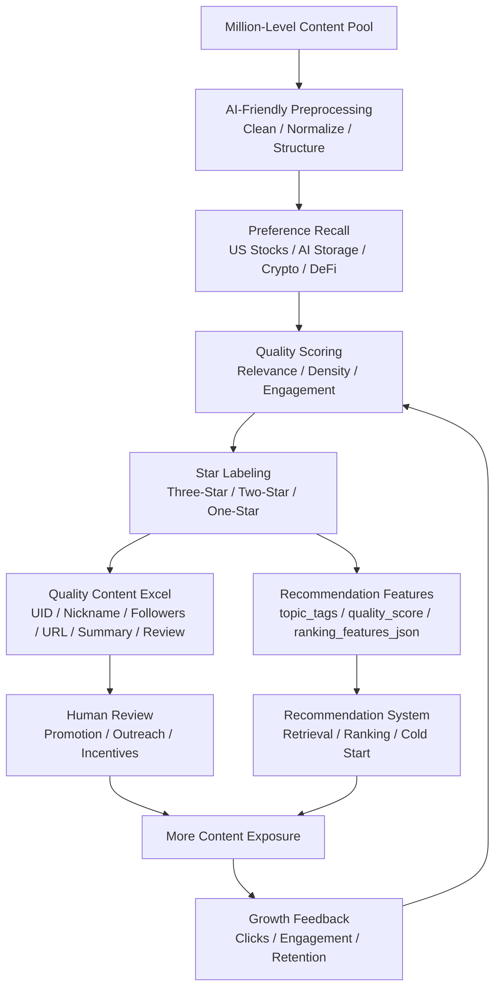

# AI Content Selector and Growth Turbo

A large-scale AI content selection and distribution engine for growth teams, recommendation systems, creator operations, and community cold starts.

It turns a million-level content pool into two practical outputs:

1. **Quality Content Excel** for review, promotion, creator operations, and lightweight incentive workflows.
2. **Recommendation Feature Data** for retrieval, ranking, cold-start seeding, and automated distribution.

Teams can enter preference topics such as US stocks, AI storage, Crypto, macro, DeFi, or ETF. The system preprocesses local content data, filters weak entries, scores relevance, assigns one-star/two-star/three-star labels, and produces structured features that downstream systems can consume.

[中文说明](README.md)

## Growth Loop



## Why It Matters

Recommendation cold starts do not fail because a platform lacks content. They fail because teams cannot identify enough high-quality seed content quickly.

As the content pool grows, manual review breaks down. High-engagement content is not always good content. Good content is not always discovered early. This project adds a reproducible AI-assisted layer between content operations and recommendation algorithms.

- Finds high-value content from very large content pools.
- Applies preference topics such as US stocks, AI storage, Crypto, DeFi, and macro.
- Scores content by quality, relevance, density, and engagement.
- Labels content as one-star, two-star, or three-star.
- Exports a review-ready Excel file with UID, nickname, followers, content URL, quality reason, comment, and summary.
- Exports recommendation-ready features for retrieval, ranking, and cold-start pipelines.
- Keeps large raw datasets out of model context.
- Runs with only the Python standard library.

## Recommendation Feature Dimensions

Modern recommendation systems usually combine item metadata, creator metadata, interaction signals, and contextual features. This project generates the following dimensions:

| Dimension | Output Fields |
| --- | --- |
| Item metadata | `item_id`, `content_url`, `title`, `summary`, `content_type`, `topic_tags`, `content_length_bucket` |
| Creator metadata | `creator_id`, `creator_nickname`, `creator_followers` |
| Interaction signals | `engagement_score` |
| Context features | `preference_tags`, `candidate_pool`, `cold_start_candidate`, `distribution_goal`, `context_date_label` |
| Ranking payload | `quality_score`, `star_rating`, `retrieval_keywords`, `ranking_features_json` |

## Outputs

Core outputs:

| File | Purpose |
| --- | --- |
| `*_quality_content.xlsx` | Review-ready Excel file for quality content, promotion, outreach, and incentive workflows |
| `*_recommendation_features.csv` | Recommendation feature data for retrieval, ranking, cold start, and automated distribution |

Auxiliary outputs:

| File | Purpose |
| --- | --- |
| `*_quality_content.csv` | Machine-readable version of the quality content Excel |
| `*_all_scored.csv` | Full scoring table for audits and tuning |
| `*_summary.md` | Selection summary |

## Quick Start

```bash
python3 scripts/select_biweekly_highlights.py \
  --input local_content_pool.xlsx \
  --output-prefix growth_turbo_YYYY-MM-DD \
  --date-label M.D-M.D \
  --workdir ./outputs \
  --preference "US stocks" \
  --preference "AI storage" \
  --preference Crypto \
  --formal-count 50 \
  --candidate-count 100
```

## Agent Safety Rule

If a content dataset has more than 100 rows, agents must not read raw rows into model context.

Correct flow:

1. Run the selector first.
2. Inspect `*_summary.md`.
3. Inspect `*_quality_content.csv`, `*_recommendation_features.csv`, and `*_all_scored.csv`.
4. Review only a small number of raw rows when a user explicitly asks for it.

## MCP

The repository includes a local stdio MCP server:

```bash
python3 mcp/content_highlights_server.py
```

Available tools:

| Tool | Purpose |
| --- | --- |
| `select_highlights` | Runs the pipeline and generates quality content plus recommendation feature outputs |
| `inspect_summary` | Reads the summary without opening large raw content |
| `validate_outputs` | Checks generated files and validates the workbook package |
| `preview_scored_csv` | Safely previews the top rows of a scored output |

## Validation

```bash
python3 -m py_compile scripts/select_biweekly_highlights.py mcp/content_highlights_server.py
python3 -m unittest discover -s tests
python3 scripts/select_biweekly_highlights.py --help
```

## Privacy

This repository intentionally excludes real content pools, generated outputs, private preference files, personal paths, credentials, cookies, tokens, and `.env` files.
